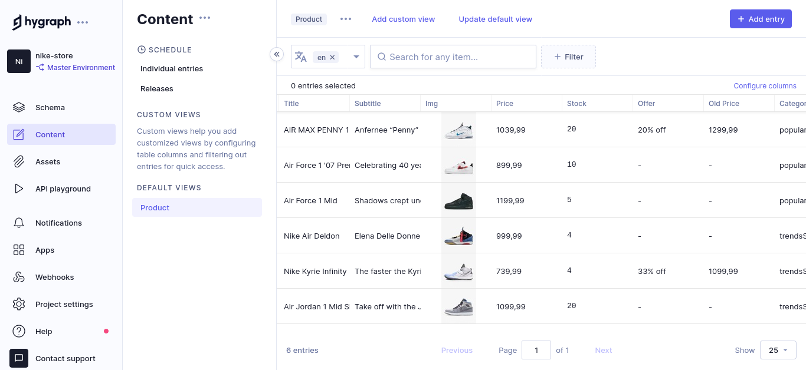

# Nike Store | Clean Architecture, Stripe API & Redux


> Project developed with the aim of practicing the `integration of a payments API` with the application, in addition to `processing
> payment via backend to improve application security`. Product data such as pricing, images, and inventory information is
> stored, but can also be managed on the `Hygraph Headless CMS platform`. So the flow of this application is to register a consumer with
> an address associated with it, it can see the available products and buy as many as it wants (as long as it does not exceed the stock limit),
> when proceeding to `checkout`, the consumer must confirm the shipping address of the purchase, and request the checkout session, in which the data
> are processed by the backend, finally after successfully completing the purchase, a valid session is created containing the purchase information and by
> order are added to a database, where we use the Hygraph product id to identify the product, it is sent as `metadata`, for the `Stripe API`.

:arrow_right: GraphQL, Hygraph and E-Commerce Security <br /> 
:arrow_right: Stripe API <br /> 
:arrow_right: Clean Architecture <br /> 
:arrow_right: Absolute imports <br />
:arrow_right: TailwindCSS - Styling Functions in the Style Object <br />

<br />

## GraphQL, Hygraph and E-Commerce Security

GraphQL is a `query language for APIs` and a runtime for fulfilling those queries with your existing data. GraphQL provides a complete and understandable description of the data in your API, `gives clients the power to ask for exactly what they need and nothing more`, makes it easier to evolve APIs over time, and enables powerful developer tools.

 - <strong>Ask for what you need, get exactly that</strong>

Send a GraphQL query to your API and get exactly what you need, nothing more and nothing less. `GraphQL queries always return predictable results`. Apps using GraphQL are fast and stable because they control the data they get, not the server.

 - <strong>Get many resources in a single request</strong>

GraphQL queries access not just the properties of one resource but also smoothly follow references between them. While typical REST APIs require loading from multiple URLs, `GraphQL APIs get all the data your app needs in a single request`. Apps using GraphQL can be quick even on slow mobile network connections.

```graphql
query getProductsByCategory($category: String) {
  products(where: { category: $category }) {
    id
    category
    title
    subtitle
    stock
    img {
      url
    }
    price
    offer
    oldPrice
  }
}
```

*<i>graphql.org</i> <br />

### Hygraph and E-Commerce Security

The server through which the page is processed, as well as the customer acquire the product information through a common source, in this case I chose to use `Hygraph which is a Headless CMS` (Content Management System), which is a great option for manage the content of a website if you don't want to waste time implementing the entire interface, backend, as well as the database.

<div align="center">

</div>

 - <strong>Process and acquire data entirely through the backend, rely as little as possible on information coming from the client side</strong>
 
In common applications we are used to sending all the data that the backend needs to do the proper processing, as we already process this information on the client side to show the consumer the purchase/checkout information and the product itself, we could think of sending these information for the backend to process properly, however `the client, the web page must behave only as an interface`, an intermediary that sends the information of operations that the user wants to carry out. `Otherwise sensitive information can be intercepted and even altered by the front-end`, and thus the data that would arrive at the backend would no longer maintain an integrity, or a reliability factor.

So `the solution to avoid manipulation of purchase data and avoid fraud` was to make the customer send only the `ID and Quantity` of the product to the backend, that is, the backend now only depends on this information to process all the data purchase, acquiring the product data from a reliable source, from Hygraph itself, the application's Headless CMS.

```ts
// src/infra/http/graphql/queries.ts

import dotenv from "dotenv";

dotenv.config();

export const getProductById = async (ids: string[]) => {
  const products = await fetch(process.env.CMS_API_URL!, {
    method: "POST",
    headers: {
      "Content-Type": "application/json",
      Authorization: `Bearer ${process.env.HYGRAPH_API_ACCESS_TOKEN}`,
    },
    body: JSON.stringify({
      query: `
      query getProductById($ids: [ID]) {
        products(where: { id_in: $ids }) {
          id
          title
          stock
          img {
            url
          }
          price
        }
      }
      `,
      variables: {
        ids,
      },
    }),
  })
    .then((res) => res.json())
    .then((result) => result.data.products)
    .catch((error) => console.log(error));

  return products;
};
```

<br />

## Stripe API 

Complete and functional code of an integration with Stripe Checkout. Client and server side code redirects to a pre-built payment page hosted by Stripe.

### Prebuilt Checkout page

#### Install the Stripe Node library

Install the package and import it in your code. Alternatively, if you’re starting from scratch and need a package.json file, download the project files using the Download link in the code editor.

 - `npm install --save stripe`

#### Create a Checkout Session

`Add an endpoint on your server that creates a Checkout Session. A Checkout Session controls what your customer sees on the payment page such as line items, the order amount and currency, and acceptable payment methods`. We enable cards and other common payment methods for you by default, and you can enable or disable payment methods directly in the Stripe Dashboard.

#### Define a product to sell

`Always keep sensitive information about your product inventory, such as price and availability, on your server to prevent customer manipulation from the client`. Define product information when you create the Checkout Session using predefined price IDs or on the fly with `price_data`.

```ts
// src/infra/http/mappers/index.ts
export function toCheckoutMapper(items: []) {
  const newObject = items.map((item: any) => {
    return {
      price_data: {
        currency: "BRL",
        product_data: {
          name: item.title,
          images: [item.img.url],
          metadata: {
            hygraphId: item.id,
          },
        },
        unit_amount: Number(stringPriceToNumber(item.price)) * 100,
      },
      quantity: item.quantity,
    };
  });

  return newObject;
}
```

 - <strong>Metadata with stripe-node</strong> - *Metadata `is useful for storing additional`, structured information on an object. As an example, you could store your user's full name and corresponding unique identifier from your system on a Stripe Customer object. Metadata is not used by Stripe, for example, not used to authorize or decline a charge, and won't be seen by your users unless you choose to show it to them. In this video you'll learn how to work with metadata from the Stripe API.

#### Choose the mode

Checkout has three modes: `payment, subscription, or setup`. Use payment mode for one-time purchases. Learn more about subscription and setup modes in the docs.

#### Supply success and cancel URLs

`Specify URLs for success and cancel pages—make sure they’re publicly accessible so Stripe can redirect customers to them`. You can also handle both the success and canceled states with the same URL.

#### Redirect to Checkout

After creating the session, `redirect your customer to the URL for the Checkout page returned in the response`.

*<i>stripe.com/docs/checkout/quickstart</i> <br />

```ts
// src/infra/database/repositories/prisma-purchases-repository.ts

// Product price information must be handled only by the application server
// This is the shape in which stripe expects the data to be
const transformedItems = toCheckoutMapper(mergeArray);

// Create checkout session
const params: Stripe.Checkout.SessionCreateParams = {
  payment_method_types: ["card"],
  line_items: transformedItems,
  mode: "payment",
  success_url: `${process.env.ORIGIN}?session_id={CHECKOUT_SESSION_ID}`,
  cancel_url: `${process.env.ORIGIN}/`,
};


const checkoutSession: Stripe.Checkout.Session =
  await stripe.checkout.sessions.create(params);

return { proceedToCheckout: true, checkoutSession };

// src/infra/http/controllers/checkout-controller.ts
async checkoutSession(
  request: FastifyRequest<{ Body: CreateCheckoutSessionRequest }>,
  reply: FastifyReply,
) {
  const prismaPurchasesRepository = new PrismaPurchasesRepository();
  const service = new CreateCheckoutSession(prismaPurchasesRepository);

  try {
    const products = request.body;

    const result = await service.execute({
      data: products,
    });

    const checkoutSession: Stripe.Checkout.Session = result.checkoutSession;

    reply.status(200).send(checkoutSession);
  } catch (error) {
    new TriggersError(error, reply);
  }
}
```


